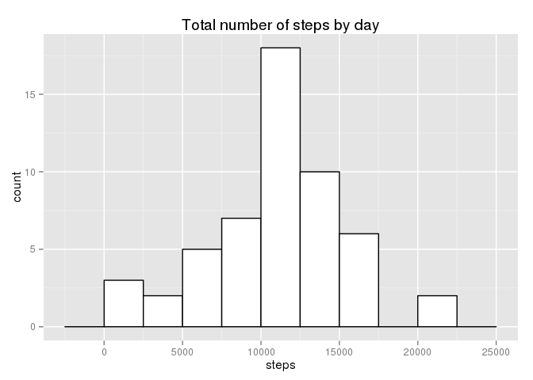
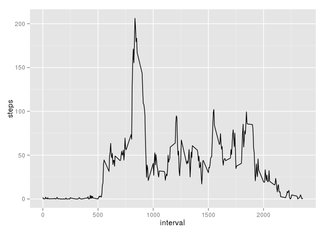
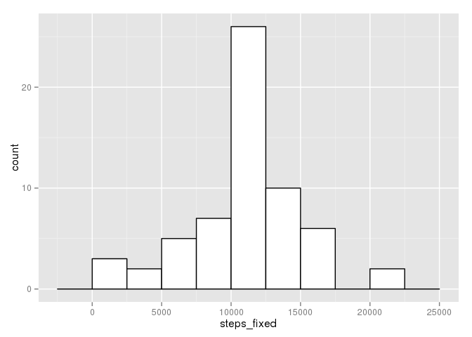
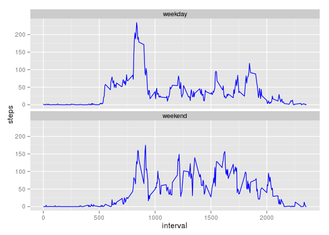

# Reproducible Research: Peer Assessment 1


## Loading and preprocessing the data

This is the R code with comments inside. No need to comment extra.


```r
# unzip data
unzip("activity.zip")

# read data
data <- read.csv("activity.csv", header=T, quote="\"", sep=",",
				 colClasses=c("numeric","Date","numeric"))

# selecting week days and putting data inside the set
data$wd <- factor(ifelse(as.POSIXlt(data$date)$wday %in% 1:5, "weekday", "weekend"))

# get only complete cases
data_compl <- data[complete.cases(data),]
```


## What is mean total number of steps taken per day?

Calculate mean number of step:


```r
steps_day <- aggregate(steps ~ date, data=data_compl, FUN=sum)
```

The plot is done with:

```r
library(ggplot2)
plot1 <- ggplot(steps_day, aes(x=steps)) +
	geom_histogram(binwidth=2500, fill="white", colour="black") +
	labs(title="Total number of steps by day", x="steps", y="count")
print(plot1)
```

 

The mean and median of steps is calculated with:

```r
steps_mean <- mean(steps_day$steps)
print(steps_mean)
```

```
## [1] 10766.19
```

```r
steps_median <- median(steps_day$steps)
print(steps_median)
```

```
## [1] 10765
```


## What is the average daily activity pattern?

Time series plot:


```r
steps_interval <- aggregate(steps ~ interval, data=data_compl, FUN=mean)
plot2 <- ggplot(steps_interval, aes(x=interval, y=steps)) +
	geom_line(stat="identity")
print(plot2)
```

 

Maximum number of steps:


```r
steps_interval$interval[which.max(steps_interval$steps)]
```

```
## [1] 835
```

The maximum nuber of steps was made on interval 8:35am.

## Imputing missing values

The total number of missing numbers in the dataset is:

```r
length(which(is.na(data))) 
```

```
## [1] 2304
```

Creating new dataset and inserting means from the previous part
into new column:


```r
data_new <- data
data_new$steps_fixed <- data$steps
data_new$steps_fixed[is.na(data_new$steps_fixed)] <- steps_interval$steps
```

Ploting new histogram:


```r
steps_day_new <- aggregate(steps_fixed ~ date, data=data_new, FUN=sum)
ggplot(steps_day_new, aes(x=steps_fixed)) +
    geom_histogram(binwidth=2500, colour="black", fill="white")
```

 

```r
steps_day_f <- aggregate(steps_fixed ~ date, data=steps_day_new, FUN=sum)
mean(steps_day_f$steps_fixed)
```

```
## [1] 10766.19
```

```r
median(steps_day_f$steps_fixed)
```

```
## [1] 10766.19
```

Mean is the same... meadian differs.

Looking at the plot... maximum differs.

## Are there differences in activity patterns between weekdays and weekends?

Factor variable was done right after inserting data...

Panel plot:


```r
data_wd <- aggregate(steps ~ interval + wd, data=data_new, FUN=mean)
plot3 <- ggplot(data_wd, aes(x=interval, y=steps, group=1)) +
    geom_line(colour="blue") +
    facet_wrap(~ wd, ncol=1)
print(plot3)
```

 

The plot shows that there is more activity on the weekend after 10am
but activity starts later in the day.
